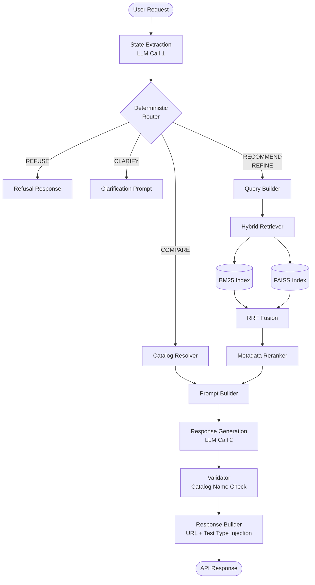
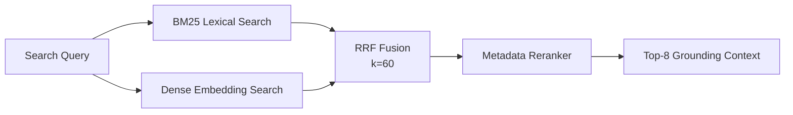

# SHL Assessment Recommendation Agent


A production-grade conversational RAG system that recommends SHL Individual Test Solutions. Built around a strictly deterministic pipeline — hybrid retrieval, rule-based routing, and catalog-grounded generation — designed to eliminate hallucinations structurally.

---

## Overview

The agent accepts a natural language hiring conversation via a REST API and returns a ranked shortlist of SHL assessments with URLs and test type codes. Every recommendation is traceable to the scraped SHL catalog; URLs and metadata are injected deterministically, never generated by the model.

**Core guarantees:**

- Zero hallucinated URLs — all metadata is sourced from `catalog.json` at response-build time
- Deterministic routing — a rule-based router controls all conversation flow; the LLM makes no routing decisions
- Stateless API — full conversation state is rebuilt from history on every request; no server-side sessions
- Exactly two LLM calls per request — one for state extraction, one for grounded response generation

---

## Architecture

### Request Pipeline



### Component Responsibilities

| Layer | Component | Role |
|---|---|---|
| **Ingestion** | State Extractor | Converts conversation history into structured hiring requirements |
| **Routing** | Rule-Based Router | Selects route — REFUSE, CLARIFY, COMPARE, RECOMMEND, REFINE |
| **Retrieval** | Hybrid Retriever | BM25 + FAISS dense search, top-20 from each source |
| **Retrieval** | RRF Fusion | Merges ranked lists using Reciprocal Rank Fusion |
| **Retrieval** | Metadata Reranker | Boosts technology matches, penalises unrelated domains |
| **Generation** | Prompt Builder | Packages top-8 catalog entries as grounding context |
| **Generation** | Response Generator | Produces reply and recommended names (catalog-grounded only) |
| **Safety** | Validator | Drops any name not matching the catalog exactly |
| **Safety** | Response Builder | Injects URLs and test type codes from catalog — model never outputs a URL |

### Retrieval Strategy



---

## Quick Start

### 1. Clone and Install

```bash
git clone https://github.com/your-org/shl-assessment-recommendation-agent
cd shl-assessment-recommendation-agent

python -m venv .venv
# Windows
.venv\Scripts\activate
# Linux / macOS
source .venv/bin/activate

pip install -e .
```

### 2. Configure Environment

```bash
cp .env.example .env
```

Edit `.env` and set your LLM provider key:

```env
LLM_PROVIDER=groq            # groq | openrouter | gemini
GROQ_API_KEY=your_key_here
```

### 3. Build Indexes

```bash
# Parse raw catalog CSV into validated JSON
python scripts/generate_catalog.py

# Build BM25 and FAISS indexes
python scripts/build_bm25_index.py
python scripts/build_embedding_index.py
```

### 4. Run the Server

```bash
make run
# or directly
python scripts/run_server.py --reload
```

Server starts at `http://localhost:8000`.

---

## API Reference

### Endpoints

| Method | Path | Description |
|---|---|---|
| `GET` | `/` | Service status |
| `GET` | `/health` | Health check — LLM, catalog, and index status |
| `POST` | `/chat` | Conversational recommendation endpoint |

### Request Format

```bash
curl -X POST http://localhost:8000/chat \
  -H "Content-Type: application/json" \
  -d '{
    "messages": [
      {"role": "user", "content": "I need a Python assessment for senior engineers."}
    ]
  }'
```

### Response Format

```json
{
  "reply": "For a senior Python engineering role, I recommend evaluating practical Python capability...",
  "recommendations": [
    {
      "name": "Python (New)",
      "url": "https://www.shl.com/solutions/products/product-catalog/view/python-new/",
      "test_type": "K"
    }
  ],
  "end_of_conversation": false
}
```

**Test type codes:** `K` = Knowledge & Skills · `P` = Personality & Behavior · `A` = Ability & Aptitude · `S` = Simulations · `B` = Biodata

---

## Conversation Behavior

The agent supports four conversational modes:

| Mode | Trigger | Behavior |
|---|---|---|
| **CLARIFY** | Missing role, seniority, or skills | Asks one targeted question |
| **RECOMMEND** | Sufficient context available | Returns ranked assessment shortlist |
| **REFINE** | User adjusts requirements | Re-runs retrieval from scratch |
| **COMPARE** | User names two or more assessments | Side-by-side catalog comparison |
| **REFUSE** | Off-topic or prompt injection detected | Politely declines and redirects |

---

## Evaluation

```bash
# Run the full evaluation harness against C1–C10 traces
python eval/replay_harness.py \
  --traces data/traces/ \
  --server http://localhost:8000 \
  --output eval/results/recall_report.json
```

The harness computes **Recall@10**, schema violations, and hallucinated URL counts per trace. Supports configurable retry and inter-turn delay to handle provider rate limits.

```bash
# Single trace
python eval/replay_harness.py --trace C1 --verbose
```

---

## Testing

```bash
# Run full test suite
make test

# Or directly
pytest tests/ -q

# Specific suite
pytest tests/agent/ -q
pytest tests/retrieval/ -q
```

375 unit and integration tests across agent, retrieval, and API layers.

---

## Docker Deployment

```bash
# Build and run with Docker Compose
make docker-compose-up

# Shut down
make docker-compose-down

# Manual build
make docker-build
make docker-run
```

See [DEPLOYMENT.md](DEPLOYMENT.md) for environment variable configuration, health check integration, and CI/CD setup.

---

## Project Structure

```
shl-assessment-recommendation-agent/
├── agent/                    # Pipeline: state extraction → routing → generation → validation
│   ├── state_extraction.py   # LLM Call 1 — extracts ConversationState from history
│   ├── router.py             # Deterministic rule-based router (5 routes)
│   ├── query_builder.py      # Builds search query from ConversationState
│   ├── generation.py         # LLM Call 2 — grounded response generation
│   ├── response_builder.py   # Injects URLs and test_type from catalog
│   └── prompts/              # System prompt templates per route
├── retrieval/                # Hybrid retrieval engine
│   ├── hybrid_retriever.py   # Orchestrates BM25 + FAISS + RRF
│   ├── metadata_reranker.py  # Deterministic post-retrieval reranking
│   └── reciprocal_rank_fusion.py
├── app/                      # FastAPI application layer
│   ├── main.py               # App factory, middleware, exception handlers
│   ├── dependencies.py       # Dependency injection
│   └── schemas.py            # Request / response schemas
├── catalog/                  # Catalog management
│   ├── catalog.json          # Canonical validated SHL catalog
│   └── raw_catalog.json      # Source data
├── eval/                     # Evaluation harness
│   ├── replay_harness.py     # Replay C1–C10 traces, compute Recall@10
│   └── results/              # Evaluation output reports
├── data/traces/              # Public conversation traces C1–C10
├── scripts/                  # Index building and server scripts
├── tests/                    # 375 unit and integration tests
├── docs/
│   └── APPROACH.md           # Engineering approach document
├── Dockerfile
├── docker-compose.yml
└── Makefile
```

---

## Technology Stack

| Category | Technology |
|---|---|
| Language | Python 3.11+ |
| Web Framework | FastAPI, Pydantic v2 |
| Lexical Retrieval | rank-bm25 |
| Dense Retrieval | Sentence Transformers (`all-MiniLM-L6-v2`), FAISS |
| LLM Providers | Groq, OpenRouter, Gemini (configurable) |
| Testing | Pytest |
| Deployment | Docker, Docker Compose |

---

## Related Documentation

- [Approach Document](docs/APPROACH.md) — design decisions, trade-offs, and evaluation methodology
- [Deployment Guide](DEPLOYMENT.md) — Docker, environment variables, CI/CD
