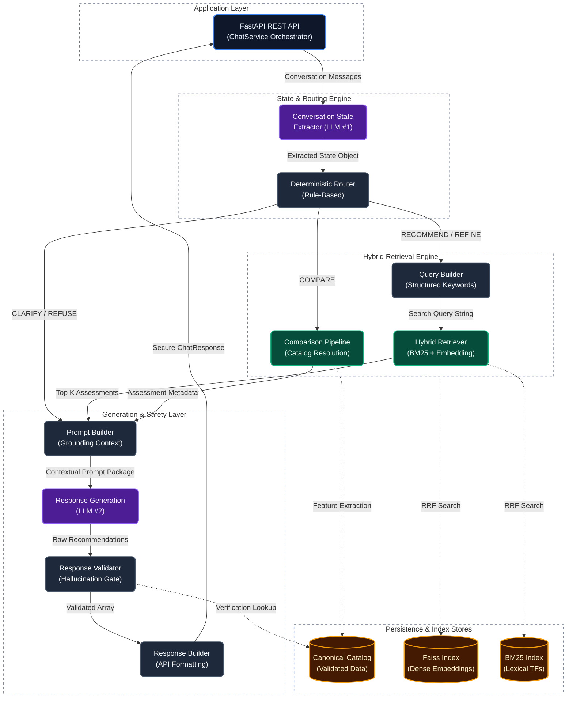

# SHL Assessment Recommendation Agent


Production-grade backend foundation for a highly deterministic Retrieval-Augmented Generation (RAG) system that recommends SHL Individual Test Solutions through conversational interaction.

---

## 📖 Project Overview

This API serves as an intelligent conversational agent designed to help users find the correct SHL assessment for their organizational hiring needs. Unlike standard conversational agents, it utilizes a deeply deterministic RAG architecture. By rigorously isolating language models from logic execution, it guarantees zero-hallucination assessment mapping and predictable routing.

### Key Capabilities
- **Deterministic Pipeline:** Hard-caps generative AI execution to exactly two controlled LLM calls per request (State Extraction and Response Generation).
- **Hybrid Retrieval System:** Combines BM25 lexical search and Dense Embedding-based semantic retrieval, merged using Reciprocal Rank Fusion (RRF).
- **Strict Guardrails:** All AI outputs pass through a deterministic validation gate cross-referencing a canonical product catalog. Hallucinated tests are systematically stripped.
- **Production FastAPI Backend:** Asynchronous API equipped with global exception handling, dependency injection, CORS, Gzip compression, and structured logging.
- **Offline Evaluation Harness:** A comprehensive framework assessing retrieval accuracy (Recall/NDCG), routing precision, state extraction F1-scores, and system latency—without altering production execution.

---

## 🏛️ System Architecture

The recommendation agent executes a strict state-machine flow orchestrated by the `ChatService`. 



---

## 🚀 Installation & Setup

1. **Clone and Virtual Environment Initialization**
   ```bash
   python -m venv .venv
   
   # Linux/MacOS
   source .venv/bin/activate
   # Windows
   .venv\Scripts\activate
   
   # Install dependencies
   pip install -e .
   ```

2. **Environment Configuration**
   Copy the `.env.example` to establish local execution variables.
   ```bash
   cp .env.example .env
   ```
   **Required Configuration:** Inject either your `OPENROUTER_API_KEY` or `GROQ_API_KEY`.

---

## 🛠️ Data Preparation & Indexing

Prior to server execution, you must parse the raw CSV catalog into validated JSON and generate search indexes.

```bash
# 1. Clean raw catalog into validated canonical JSON
python scripts/generate_catalog.py

# 2. Build dense embeddings (FAISS) and lexical indexes (BM25)
python scripts/build_index.py
```

---

## ⚡ Execution

You can initialize the FastAPI server natively via Python or utilizing the enclosed Makefile.

```bash
make run
# Alternative
python scripts/run_server.py --reload
```
The server binds asynchronously to `http://0.0.0.0:8000`.

### Core Endpoints
| Verb | Endpoint | Description |
|---|---|---|
| `GET` | `/` | Operational service status |
| `GET` | `/health` | In-depth diagnostics for LLM connectivity, Catalog, and Index loading statuses |
| `POST` | `/chat` | Conversational RAG pipeline hook |

### Request Example

```bash
curl -X POST http://localhost:8000/chat \
     -H "Content-Type: application/json" \
     -d '{
           "messages": [
             {"role": "user", "content": "I need a Python assessment for senior engineers."}
           ]
         }'
```

---

## 📊 Offline Evaluation Harness

The project includes an entirely offline framework to quantify changes in state extraction accuracy, retrieval quality, and generative response viability.

```bash
make evaluation
# Alternative
python scripts/run_evaluation.py --all
```
- **Targets Evaluated:** Routing, Extraction, Retrieval, Recommendation, and System Benchmarking.
- **Reporting:** Outputs JSON and Markdown summaries directly to `evaluation/reports/`.

---

## 🐳 Docker Deployment

The application utilizes a secure, non-root, multi-stage Docker build pipeline suitable for enterprise deployment.

### Automated Compose Orchestration
```bash
make docker-compose-up
# To spin down:
make docker-compose-down
```

### Manual Image Construction
```bash
make docker-build
make docker-run
```

For advanced production workflows and CI/CD checklists, consult [DEPLOYMENT.md](DEPLOYMENT.md).

---

## 📂 Repository Structure

```text
.
├── agent/            # State extraction, routing, prompt building, generation, validation
├── app/              # FastAPI application layer, endpoints, and dependency injection
├── catalog/          # Catalog cleaning and raw data processing
├── evaluation/       # Offline evaluation harness and datasets
├── prompts/          # System prompt templates
├── retrieval/        # Hybrid retrieval (BM25 + Embeddings + RRF)
├── scripts/          # Index generation and server running scripts
├── tests/            # Comprehensive unit and integration tests (430+ coverage)
├── Dockerfile        # Production multi-stage Docker build
├── docker-compose.yml# Container orchestration
├── DEPLOYMENT.md     # Deployment guidelines
└── Makefile          # Operational command aliases
```

---

## ⚙️ Technology Stack
- **Web Framework:** [FastAPI](https://fastapi.tiangolo.com/), [Pydantic v2](https://docs.pydantic.dev/)
- **Information Retrieval:** [SentenceTransformers (all-MiniLM-L6-v2)](https://sbert.net/), [Rank-BM25](https://pypi.org/project/rank-bm25/), [FAISS](https://github.com/facebookresearch/faiss)
- **Generative AI Providers:** [OpenRouter](https://openrouter.ai/), [Groq](https://groq.com/)
- **Testing Framework:** [Pytest](https://docs.pytest.org/)
- **Infrastructure:** Docker, Docker Compose, GitHub Actions